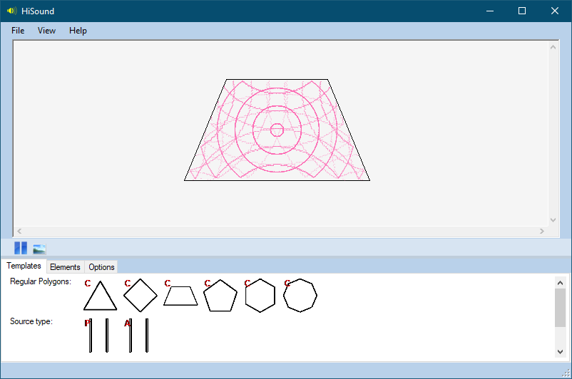
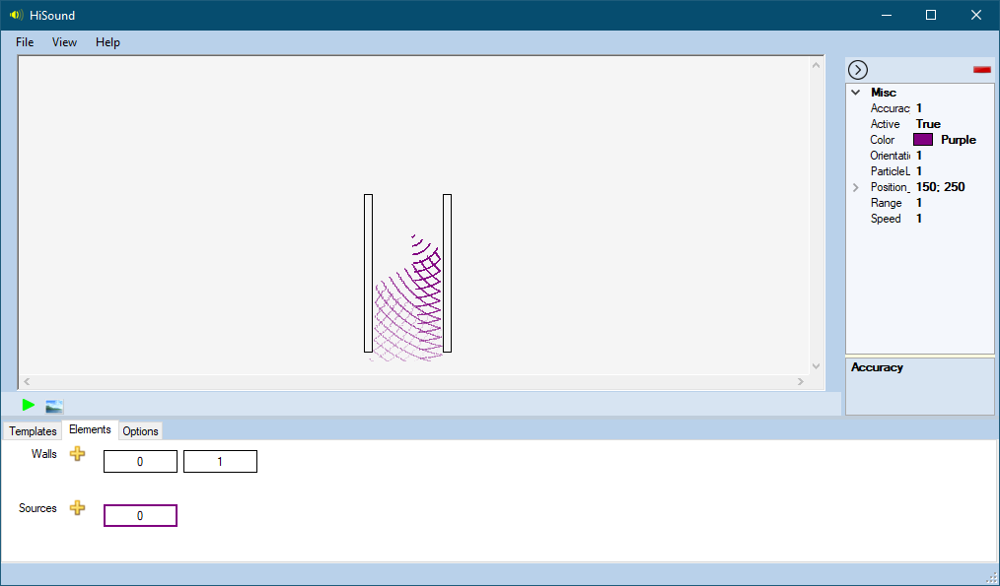
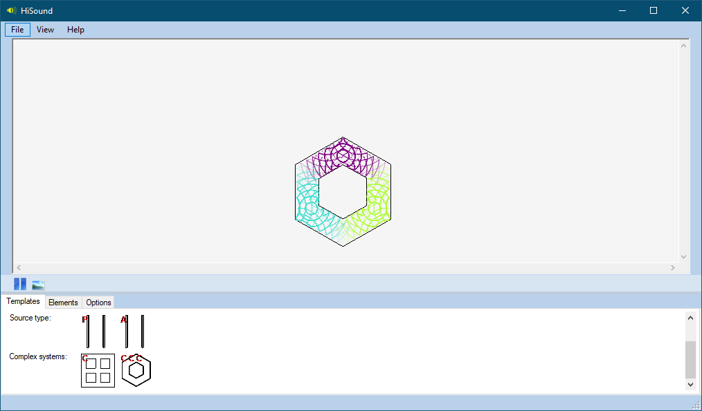
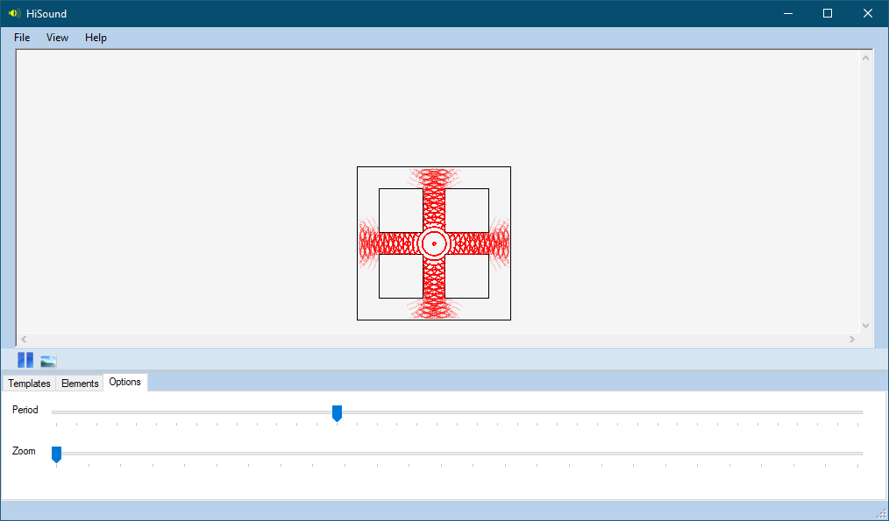
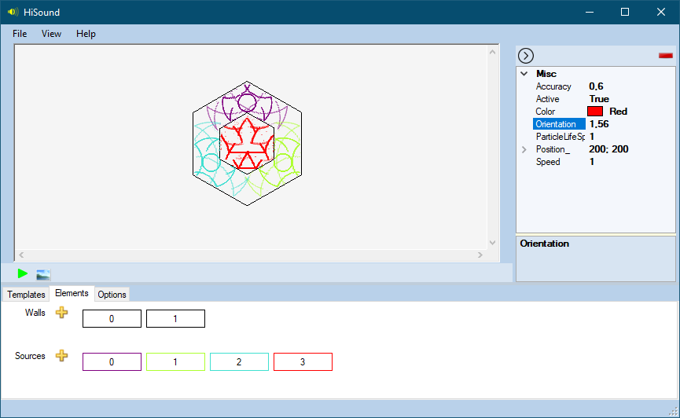

# HiSound

C# Wave reflection simulator made for a physics project in December 2019.

## Features

- Model loading/saving
- Model templates to choose from
- Screenshots
- Options to edit walls
- Options to edit wave sources: direction, beam type (circular, parallel), position, accuracy, color etc.

## Screenshots

</img>

</img>

</img>

</img>

</img>

